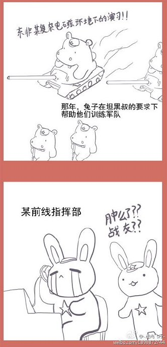
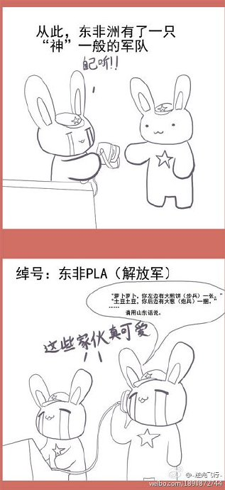
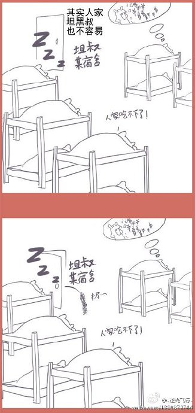
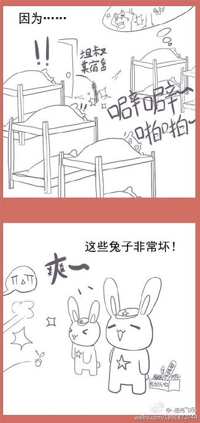
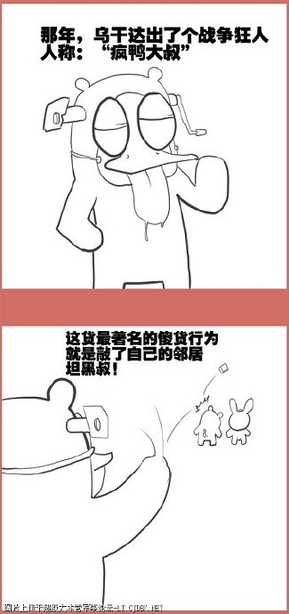
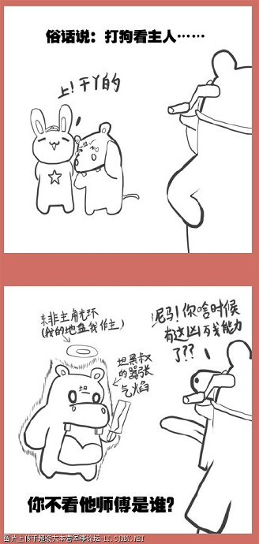
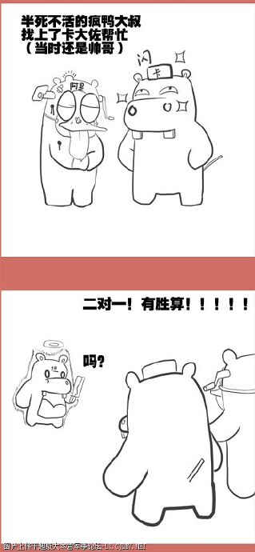
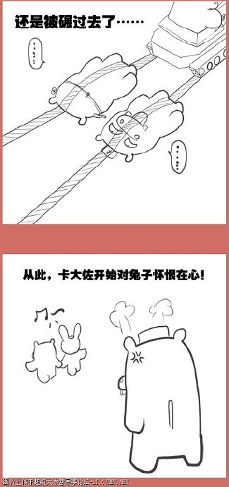

# 漫画版连载12：东非PLA

* 标签：`小白兔`、`光荣往事`、`漫画`、`坦黑叔`、`援助非洲`、`军援`、`军事顾问团`、`卡扎菲`、`乌干达`

---
 
话说非洲大陆自独立以来就和“内战”、“贫困”、“饥荒”等坏消息联系在一起，东非一隅的坦桑尼亚黑叔叔日子过得已经很不错了，内战外战不多，国内政局相对稳定，对比那些朝不保夕的黑皮肤同胞已经近似生活在天堂。这在一定程度上得益于一支带有某些东方基因的强大军队。
 
就在中国援建坦赞铁路的时候，中国军事顾问团也踏上了这片东非热土。在中国顾问“凶狠”的教导下，坦军成为黑非洲第一支能够有效进行步、炮、坦协同进攻的陆军。

这个“有效”是什么概念呢？就是坦黑叔叔在进攻的时候，坦克不会轧到自己的步兵，炮兵不会把炮弹打到自己的坦克和步兵头上！
至于中国教官们是如何“凶狠”的，有一个故事就是为了训练坦黑叔叔们地临战反应速度，经常在半夜吹紧急集合哨，但是这一招对白天已经累得只剩半条命的坦黑叔叔就是不管用，每次总有些黑叔叔落下，怎么办？教官们就带来中国特产——鞭炮，还有各种大炮仗，“给力3万响”神马的，越大声越好。晚上再也不吹哨了，直接点着往黑叔叔宿舍一扔，就等着看热闹了。可怜的黑叔叔白天刚刚被子弹的啸叫刺激得神经过敏，好不容易睡下又给这么一炸，比拿着轻机枪打空包弹还有效。

话说非洲这些黑叔叔还真不太好教，近些年就有在陆军学院留学的苏丹黑叔叔在合肥试开96式坦克，结果这些“军中精英”楞是把装有GPS的4辆96开到四个不同的方向。。。。。囧
