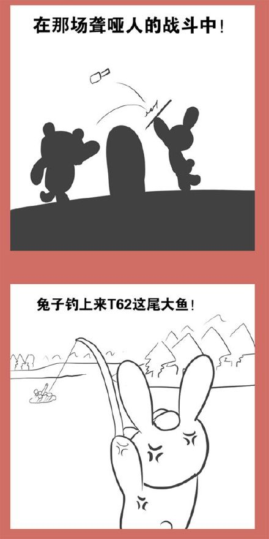
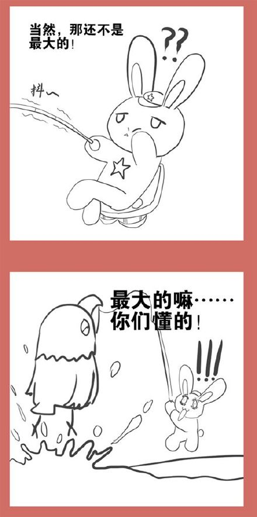
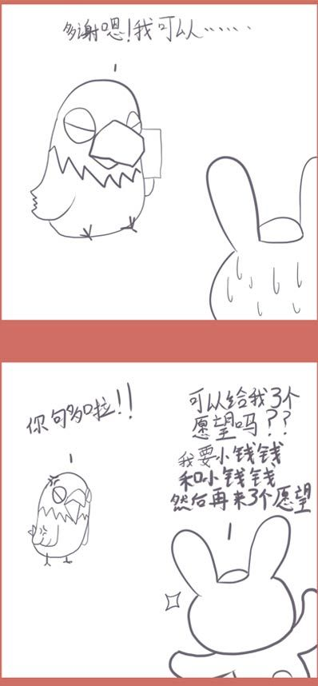
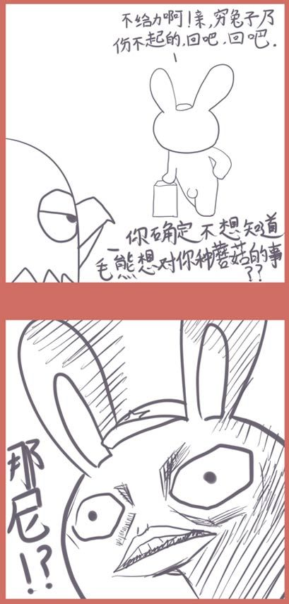
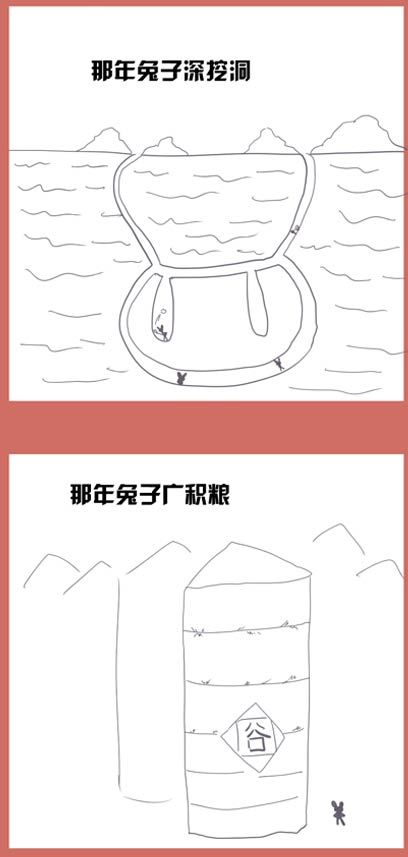

# 漫画版连载17：兔子钓鱼

* 标签：`小白兔`、`光荣往事`、`白头鹰`、`大熊`、`中苏反目`、`珍宝岛`、`t62`、`军事`、`蘑菇弹`

珍宝岛冲突中军兔缴获了一辆当时最先进的T62坦克

兔熊冲突让白头鹰终于有机会浮出水面来接触兔子

大熊曾对兔子的核打击进行过评估，结论是为了消灭兔子的蘑菇弹和7亿兔子，需要至少40亿吨当量的蘑菇弹，这足以把地球也毁灭，所以只能悻悻放弃。
