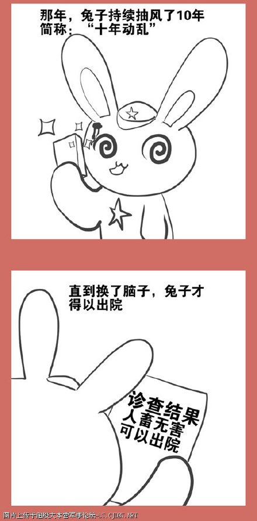
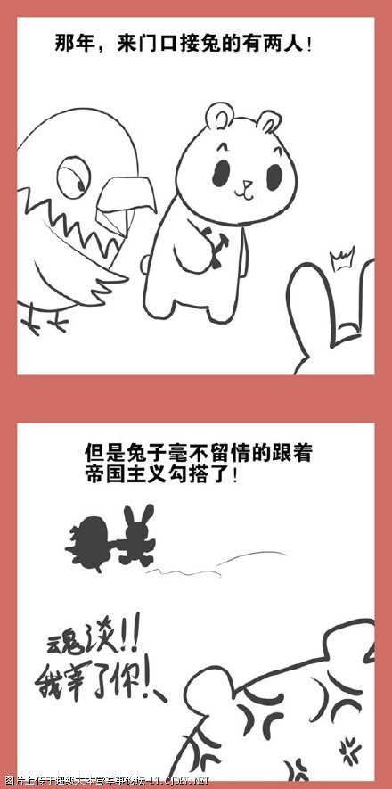
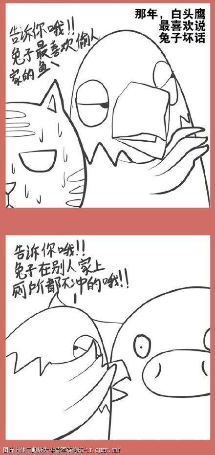
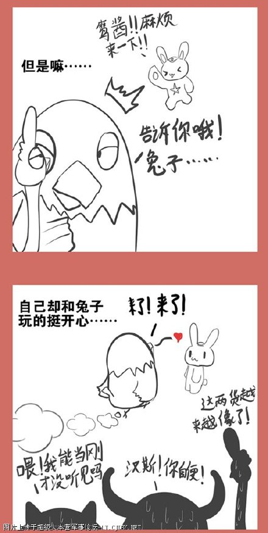
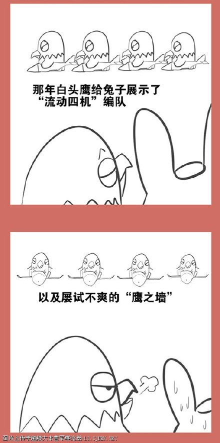
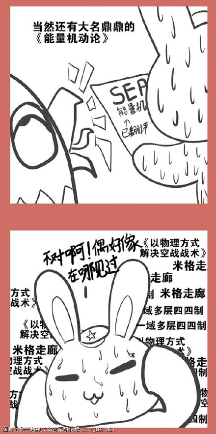

# 漫画版连载21：东方不亮西方亮

* 标签：`米格走廊`、`小白兔`、`光荣往事`、`白头鹰`、`约翰牛`、`能量空战理论`、`东方不亮西方亮`

对汉斯猫，对约翰牛，白头鹰如是说

只是为了自己和兔子玩

兔子想了解白头鹰一些最时髦的玩法，于是他发现：
 
流动四机编队=一域多层四四制？

鹰墙战术=米格走廊？？

《能量空战理论》=《以物理方式解决空战问题》？？？

……

兔子突然想起来，在抽风之前，这不就是俺家在用的东西吗？？？！
