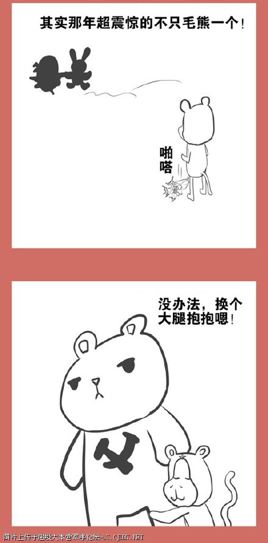
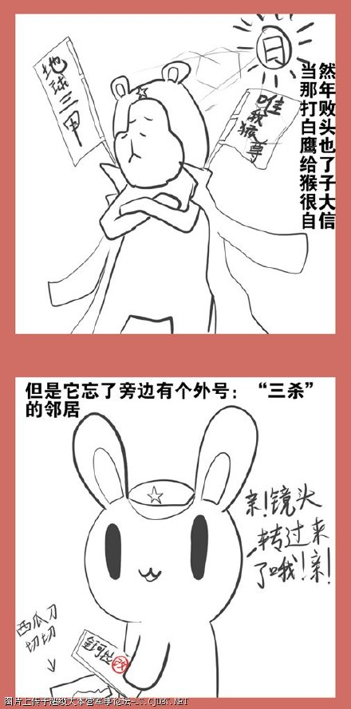
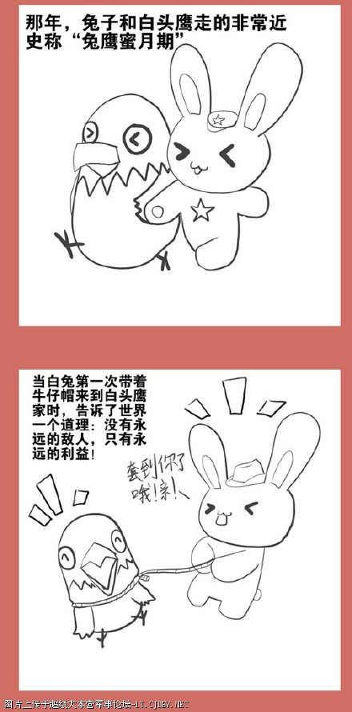
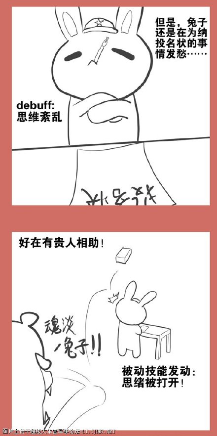
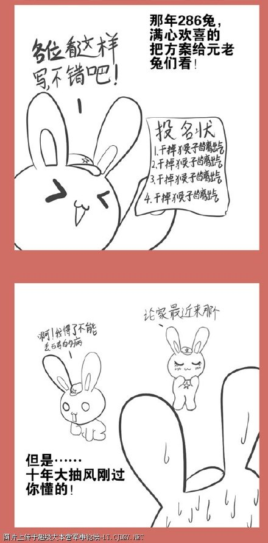
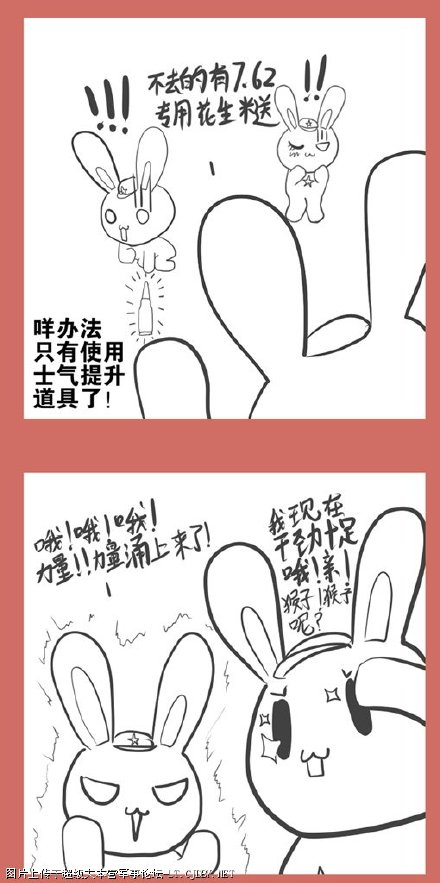

# 漫画版连载22：铁与火的南疆（上）

* 标签：`小白兔`、`光荣往事`、`白头鹰`、`毛熊`、`猴子`、`越南`、`中越边境战争`、`自卫反击`、`军事`

尼克松大统领来兔子家访问的最大成果就是

北猴子和白头鹰在巴黎签订了停战协议

北猴子准备一鼓作气解决南猴子的时候

兔子不干了

于是，果断地，北猴子抱上毛熊更粗壮的大腿

兔子就是看不惯别人称霸

286来到白头鹰家，戴上了牛仔帽，显然他套到了……

当然白头鹰要求……

既然猴子来拍砖了，那么……

事实证明，铁花生米在提升士气方面非常有效！

