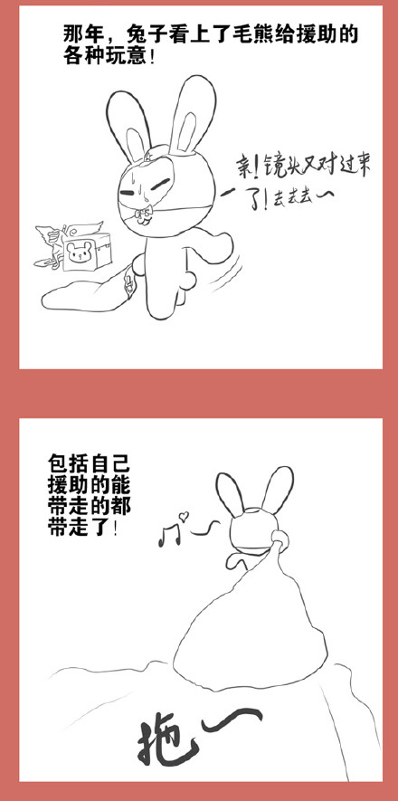
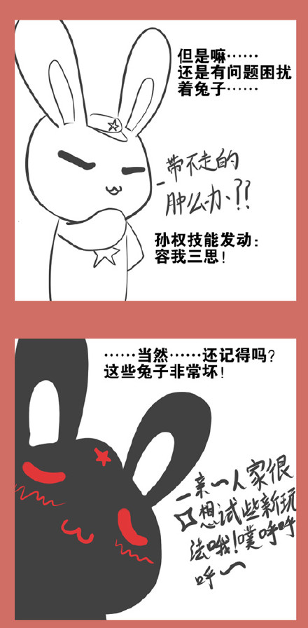
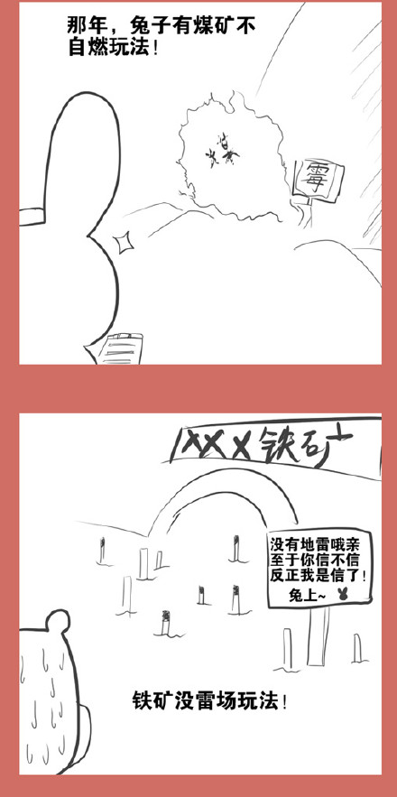
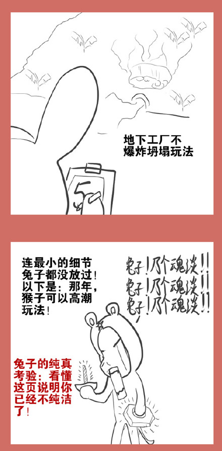

# 漫画版连载25：铁与火的南疆（续1）

* 标签：`小白兔`、`光荣往事`、`白头鹰`、`毛熊`、`猴子`、`中越边境战争`、`军事`

猴子家北边原来是毛熊和兔子援助的工业区

现在落到兔子手里

全黑版兔子发动

暴怒的小白兔立马就叫江湖人士们明白神马是专业、神马是好整以暇、神马是有条不紊、神马是有计划有步骤的，呃，劫掠！能带走的都拆走、不能带走的都炸掉、连螺丝钉也不能留下，就算能留下，螺钉和螺母也不配套。

话说当年撤军搞破坏那可是细心，工兵干正事，民兵和闲杂人等干粗活，连自行车儿童车也拉到路上给坦克碾一遍，猴子感叹当年山姆大叔也没这么狠啊！
当年，解放军的电气工程师不多，还找云锡集团临时借调。云锡集团工程小兔子当年就被借调去越南。一个班的士兵保护他，外带一个工兵营听他指挥，指哪炸哪，保证猴子的老街省3年没电用。

小白兔占领的地方仿佛一阵清风吹过，所到之处清清凉凉、轻轻溜溜……
