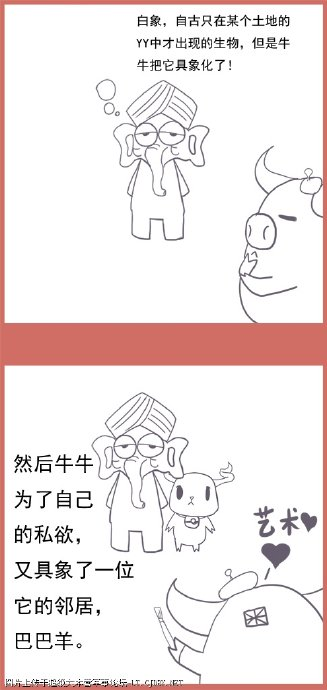
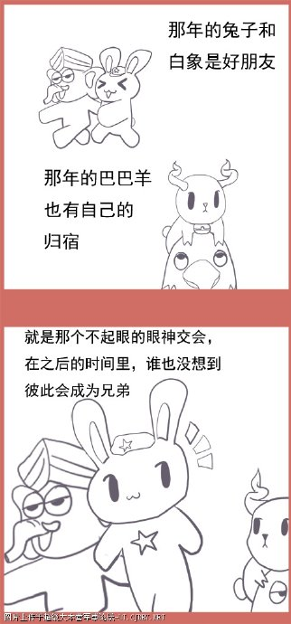
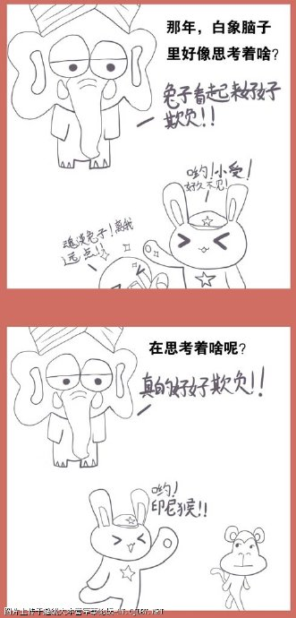
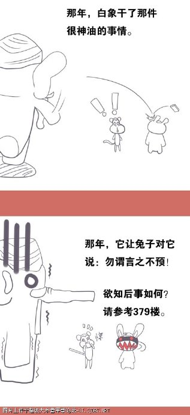
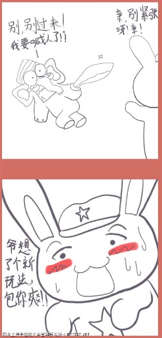
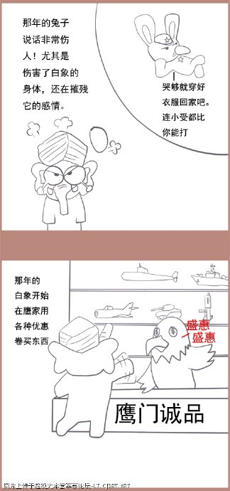
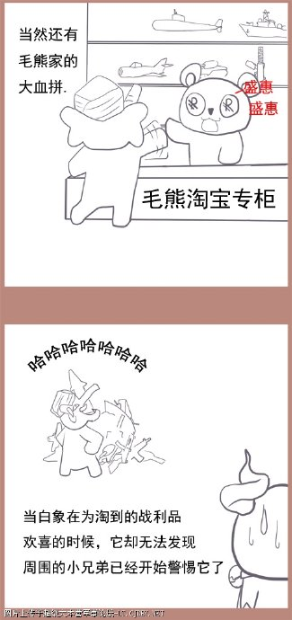

# 漫画版连载3：白象和巴巴羊

* 标签：`印度斯坦`、`英国人`、`阿育王`、`东印度公司`、`印度`

印度独立以前一直是个地理概念，无论是印度本土的孔雀王朝阿育王，还是来自中亚的突厥—蒙古血统征服者巴布尔，雄才大略的统治者都未能把自己的权威推广到我们今天所知的印度全境。古代地理概念上的“印度斯坦”包括了今天的印度、巴基斯坦、孟加拉国和斯里兰卡，阿富汗和尼泊尔部分地区也包含其中。
今天的印度很大程度上拜英国殖民者所赐。整个南亚次大陆上第一次归属于同一个统治者竟然是英属东印度公司。英国人用了200年的时间，发挥枪炮和头脑的优势，对印度斯坦大小几百个土邦鲸吞蚕食，居然做到了。英国人不仅为印度大陆带来了鸦片和茶叶，同时也为印度买办和精英换上殖民帝国思维。
这批带有“新思维”印度精英，历代都在寻求自身阶层利益的最大化，在经历了历次暴力运动失败后，转而寻求政治合法化独立。在英国式微的第二世界大战中，这批统治精英终于抓住机会，以帮助日本人相要挟获得了英国承诺在胜利后承认其独立地位。
